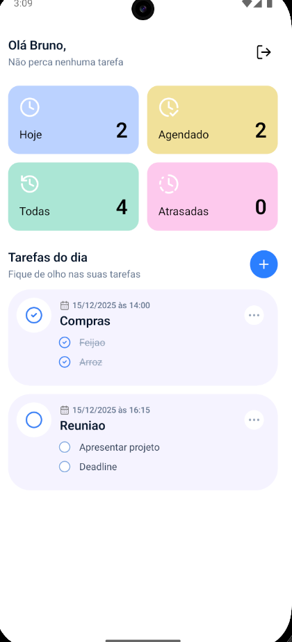

# Listify

Aplicativo React Native para gerenciamento de tarefas com subtarefas, autenticação Firebase e persistência de dados com Firestore.

## Conta de testes
- Email: `tester@teste.com`
- Senha: `123456`

## Screenshots

## Stack
- React Native
- Firebase (Auth/Firestore)
- React Navigation
- React Query
- Zustand
- Tailwind (via `uniwind`)

## Requisitos
- Node 20+
- Yarn ou npm
- Ambiente React Native configurado (Android/iOS SDKs)

## Como rodar
- `yarn start` – inicia o Metro
- `yarn android` / `yarn ios` – build e run
- `yarn test` – Jest

## Testes
Mocks básicos do Firebase estão em `jest.setup.ts`. Utilize o helper `renderWithProviders` em `src/utils/tests/render.tsx` para componentes/hooks que dependem de React Query ou Navigation (habilite/desabilite o Navigation conforme necessário).

## Estrutura
- `src/screens` – views e lógica específica de tela
- `src/components` – componentes reutilizáveis
- `src/services` – integrações (auth, tasks, firebase)
- `src/store` – Zustand
- `src/types` – tipagem de domínio/Firestore/UI
- `src/utils` – helpers de datas, UI, testes
